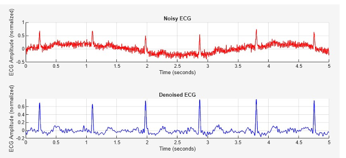

# ECG Signal Denoising using Digital Signal Processing (MATLAB)

## Objective

To design and implement a multi-stage digital signal processing pipeline for removing noise from ECG signals while preserving important signal features.

---

## Problem Statement

ECG signals are low-amplitude and easily affected by noise such as baseline drift, power-line interference, and high-frequency artifacts. These distort the signal and make accurate analysis difficult, requiring effective denoising while preserving key features like the QRS complex.

---

## Approach

A hybrid DSP-based denoising pipeline was implemented:

1. **Band-Pass Filtering (0.5–35 Hz)**
   Removes baseline drift and high-frequency noise

2. **Notch Filtering (50 Hz)**
   Eliminates power-line interference

3. **Wavelet Denoising (DWT)**
   Reduces non-stationary noise while preserving signal morphology

4. **Adaptive Filtering (RLS)**
   Removes residual noise dynamically

---

## Tools Used

* MATLAB
* Signal Processing Toolbox
* Wavelet Toolbox

---

## Dataset

* PhysioNet ECG datasets (MIT-BIH Arrhythmia Database)

---

## System Pipeline

---

## Results

### Noisy ECG Signal & Denoised ECG Signal

---

## Performance Metrics

* Signal-to-Noise Ratio (SNR)
* Mean Squared Error (MSE)
* Percentage Root Mean Square Difference (PRD)

The system showed consistent improvement in SNR and reduction in noise while preserving key ECG features like the QRS complex.

---

## Key Observations

* Multi-stage filtering improves denoising performance significantly
* Wavelet transform is effective for non-stationary signals
* RLS adaptive filtering enhances final output quality
* Important ECG morphology is preserved after processing

---

## Conclusion

A hybrid DSP-based ECG denoising system was successfully implemented and validated using real datasets. The approach effectively removes noise while maintaining signal integrity, making it suitable for biomedical signal processing applications.

---

## Future Work

* Real-time ECG signal processing
* FPGA or embedded implementation
* Integration with wearable devices
